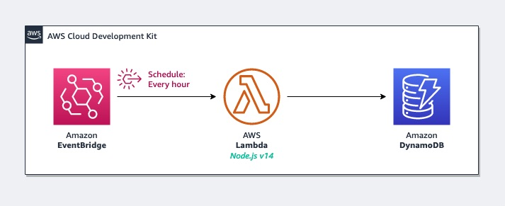

# Automated, shared testing pipeline for AWS Lambda codefiles and AWS CDK constructs

This repository illustrates how to set up a shared testing process for both
[AWS Lambda][lambda] functions, as well as the [AWS CDK][cdk] constructs that describe how
these are deployed onto the AWS Cloud.

The same structure can be adapted for most anything that requires having to deploy
loose codefiles onto AWS resources (e.g. Lambda functions, Jupyter notebooks, etc.)

> ### Why?
>
> The AWS CDK allows us to describe our infrastructure in the same coding language as
> the raw codefiles we're using as the content of our Lambda functions — this allows us
> to test both the logic and the infrastructure that runs that logic in one go.
>
> It is important that we are able to verify as much of the logic and behavior of
> systems as possible before we deploy them. This allows us to catch potential defects
> much faster than if we were performing all testing on the target platform itself.
>
> A healthy development pipeline will generally consist of testing both on and off-platforms.

Testing in this codebase is done using [Jest][jest], which is the test runner installed
when you use the [AWS CDK CLI][aws-cdk] tool to [bootstrap a new project][cdk-init].

## Sample Application System



This codebase deploys a simple system: an [AWS Lambda][lambda] function is saves the current date and
time to an [Amazon DynamoDB][dynamodb] table whenever it's triggered. This function is invoked every hour
using an [Amazon EventBridge][eventbridge] schedule.

## Usage

### Structure

Primary code is organized accordingly:

- `code/` — loose codefiles (e.g. code files for Lambda functions, Jupyter notebooks, etc.)
- `infra/` — AWS CDK constructs (e.g. this is your [IaC][iac] component, and what deploys your resources into AWS.)

### Prerequisites

You will need to have **Node.js** installed on your environment to use this codebase.
This was prepared using `v14.x`, but it should work with `v12.x` and higher.
Review your installed version with `node --version`.

All of this codebase's dependencies are listed in `package.json`.
Run the following command from your project root to install dependencies:

```bash
yarn

# :: or
npm install
```

### Running Tests

This codebase is configured to treat any file `*.test.ts` or `*.spec.ts` as a test file,
processed by [Jest][jest]. The test files are placed alongside the code files they're
meant to test.

> So `foo.test.ts` will be testing `foo.ts` (generally mocking everything else),
> and will be placed in the same directory.

To change this behavior (and any other piece of configuration),
see `jest.config.js`.

You can run tests by:

```bash
yarn test

# :: or
npm test
```

Jest allows you to automatically run tests related to changed files as you're modifying
codefiles too:

```bash
yarn test --watch
# :: or
npm test -- --watch
```

---

## Security

See [CONTRIBUTING](./contributing.md) for more information.

## License

This project is licensed under the MIT-0 license.

[lambda]: https://aws.amazon.com/lambda
[cdk]: https://aws.amazon.com/cdk
[iac]: https://docs.aws.amazon.com/whitepapers/latest/modern-application-development-on-aws/managing-infrastructure-as-code.html
[jest]: https://jestjs.io
[dynamodb]: https://aws.amazon.com/dynamodb
[eventbridge]: https://aws.amazon.com/eventbridge
[cdk-init]: https://docs.aws.amazon.com/cdk/latest/guide/work-with-cdk-typescript.html#typescript-newproject
[aws-cdk]: https://www.npmjs.com/package/aws-cdk
